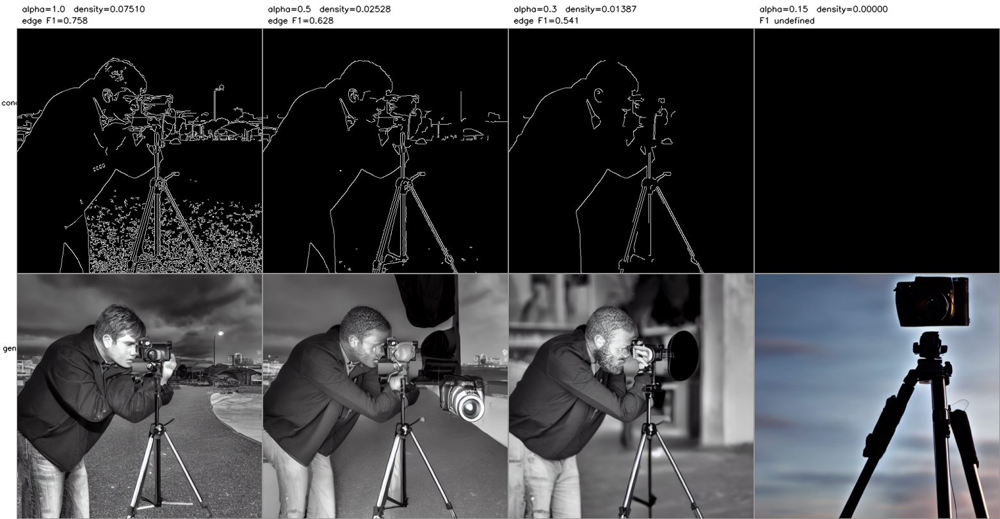

# ControlNet の制御が効かなくなる条件と、その機構

映像メディア学 レポート課題

新井 滉明（Komei Arai）／学籍番号 48266454
東京大学大学院 情報理工学系研究科 電子情報学専攻 修士1年／伊庭研究室
研究テーマ：進化計算・学習における資源の会計

ソースコード：https://github.com/komeiall14/controlnet-failure-analysis

---

**本レポートで示したこと。** ControlNet の制御が壊れる条件を 3 つ切り出し、いずれも「なぜ壊れるか」まで実験で示した。推奨されている省メモリ設定が黙って出力を壊す件は、原因が `get_attention_scores` の未初期化バッファであることを突き止め、1 行で修正した。条件地図の密度が下がると制御が消える件は、指定した輪郭との一致が 0.7329 から 0.2391 へ落ちて偶然の水準と区別できなくなる一方、生成画像自体は破綻しない。UNet へ注入される残差を直接測ると密度とともに縮んでおり（ρ=+0.875）、**制御が消えるのは残差が消えるからではなく、条件地図に由来する成分が縮むからである。** ここから密度を揃える前処理を作り、構造整合が改善してプロンプト追従は下がらないことを確かめた。

## 1. 対象論文

Lvmin Zhang, Anyi Rao, Maneesh Agrawala.
"Adding Conditional Control to Text-to-Image Diffusion Models."
*Proceedings of the IEEE/CVF International Conference on Computer Vision (ICCV)*, 2023, pp. 3813–3824. DOI: 10.1109/ICCV51070.2023.00355（本会議の full paper。公開モデル `lllyasviel/sd-controlnet-canny` が利用できる）

この論文が扱っているのは、テキストだけでは指定できない条件を、学習済みの巨大な拡散モデルに後付けする問題である。「猫の絵」はプロンプトで頼めるが、「この輪郭に沿った猫」は言葉にならない。輪郭・深度・人物の姿勢のような空間的な指定を渡したい。素朴には条件つきで再学習すればよいが、Stable Diffusion のような規模のモデルを条件ごとに学習し直す計算資源は個人にはない。論文が障害として挙げているのはむしろデータ量で、特定の条件では最大級のデータセットでも約10万枚と LAION-5B の5万分の1しかなく、その量で直接微調整すれば過学習と破滅的忘却を招くと述べている。

ControlNet の答えは、元のモデルには一切手を触れないというものである。重みを凍結したまま、そのエンコーダと中間ブロックの複製を作って条件を受け取らせ、複製の出力を zero convolution という 0 で初期化した層を通して元のモデルへ残差として加える。

同じ枠組みで条件の種類を差し替えられるのも特徴で、輪郭・深度・姿勢・領域分割がそれぞれ別の分岐として公開されている。本レポートが扱うのは輪郭（Canny エッジ）による条件づけである。

## 2. 手法理解

ControlNet は学習済み拡散モデルの重みを凍結したまま、そのエンコーダ 12 ブロックと中間ブロックの複製（trainable copy）を作り、両者を zero convolution で接続する。複製の出力は元の U-Net の 12 本のスキップ接続と中間ブロックに加算される。論文が与える式は

    y_c = F(x; Θ) + Z( F( x + Z(c; Θ_z1) ; Θ_c) ; Θ_z2)

である。ここで F は凍結された元のブロック、c が条件（本レポートでは Canny エッジ地図）、Z が zero convolution である。Z は重みとバイアスを 0 に初期化した 1×1 畳み込みなので、学習開始時点では両方の Z が 0 を返し、y_c = y すなわち元のモデルの出力と完全に一致する。論文がこの設計を採った理由として述べているのは、有害な雑音が微調整に影響しないようにパラメータを 0 から徐々に育てるためである。

残差の重み付けは適用条件を正確に押さえておく必要がある。論文が解像度に応じた重み `w_i = 64/h_i`（深いブロックほど強い）を導入しているのは推論の節のうち classifier-free guidance に関する箇所で、条件画像を条件側の予測だけに加える場合の手当てである。常に全接続へ掛けるとは書かれていない。diffusers 0.31.0 もこれに対応し、`guess_mode` のときだけ `torch.logspace(-1, 0, ...)` の重みを掛け、既定では全ブロックに `controlnet_conditioning_scale` を一様に掛ける（`models/controlnet.py` L844-851）。向きは論文と同じで幅も 10 倍と論文の 8 倍に近い。移植の欠落ではない。

本レポートの実験は `guess_mode` を既定の無効のまま行っているので、残差には全ブロックに一様な係数が掛かっている（係数の値自体は第 4.3 節以降で振る）。第5節で段ごとの残差を比較するときに重みの補正を入れていないのはこのためである。推論時に露出しているつまみは `controlnet_conditioning_scale`（既定 1.0）で、上式の第2項に掛かる係数にあたる。

学習の設定で本レポートに直接関わるのは、**プロンプトの 50% を空文字に置き換えて学習している**点である。論文はその狙いを「条件画像の意味を直接認識する能力を高めるため」と述べている。つまりこのモデルは、テキストが無いときには条件地図そのものから意味を読み取るよう仕向けられている。

両方の Z が 0 を返すのは、論文が述べているとおり**学習開始の時点だけ**である。学習後の zero convolution は 0 で初期化された重みが育っているので、条件が空でも 0 を返すとは限らない。実際、学習済みの重みに全画素 0 の地図を与えても、UNet へ渡される残差は 0 にならない（第5節で測る）。加えて第2項は Z(F(x + Z(c;Θ_z1); Θ_c); Θ_z2) であり、条件が消えても潜在変数 x が trainable copy を通る成分は残る。

したがって条件が情報を失ったときに起きるのは、第2項が 0 になることではない。**条件地図に由来する成分が失われ、残差の大きさが縮む**のである。学習が「条件地図から意味を読む」方向に偏っている以上、失われるのは輪郭の指定だけでなく、モデルが読み取るはずだった意味も含む。第5節ではこの退化を残差の大きさとして測る。

論文自身のアブレーションが、この構造の二つの側面を示している。zero convolution を通常の畳み込みに置き換えると性能が軽量版と同程度まで落ち、その理由を論文は微調整の途中で trainable copy の事前学習済みバックボーンが壊れるためだと説明する。一方その軽量版については、条件画像を解釈するには力不足であり、プロンプトが不十分または無い条件で失敗すると述べている。制御の強さは追加ネットワークの表現力と、その事前学習済みの表現を壊さずに残差を渡せるかの両方で決まっており、zero convolution が担っているのは後者である。

なお論文本文には Limitations に相当する節が置かれていない（arXiv 版・ICCV 版本体の双方で確認）。ControlNet 自身の限界として明示されているのは、ICCV 版 supplementary の Figure 28 の一点だけである。条件画像の意味が誤って認識された場合、強いプロンプトを与えてもその悪影響を取り除きにくい、という内容である。なお同 supplementary の第 2.1 節には、複数の制御を扱えないことや微調整データが少ないと過学習・忘却が起きることも書かれているが、これはアブレーションの比較対象として置かれた「元の重みを直接微調整する構成」の限界であって、ControlNet の限界ではない。

## 3. 実行環境

| | |
|---|---|
| 計算機 | Apple M1（8コアGPU）／RAM 16GB／macOS 14.4.1（23E224） |
| バックエンド | PyTorch 2.2.2 の MPS（CUDA なし） |
| ライブラリ | diffusers 0.31.0／transformers 4.44.2／OpenCV 4.11.0 |
| モデル | Stable Diffusion v1.5 ＋ sd-controlnet-canny。重みは計 1.43×10⁹ パラメータで fp16 なら約 2.7GiB（配布されている fp32 の実体はディスク上 5.3GiB） |
| サンプラ | DPMSolver++ 2M（Karras）20ステップ、512×512 |
| 生成速度 | 20ステップ・512×512 で 1枚あたり 76〜184秒（n = 157、中央値 106.5秒、平均 110.8秒）。第4.1節の切り分けと速度比較は DDIM 4ステップなので別条件である |

サンプラの選択には制約があった。当初は公式のサンプルコードに合わせて UniPC を使ったが、補正段で呼ぶ `torch.linalg.solve` が MPS では未実装のため例外で止まる。閉形式の更新だけで済む DPMSolver++ 2M に替えて回避した。CUDA を前提に書かれたコードをそのまま動かせない例である。

## 4. Failure Case Analysis

<!-- 最重要項目。3本立て。 -->

### 4.1 推奨されている省メモリ設定が、沈黙したまま出力を壊す

最初の生成が一枚も成立しなかった。返ってきた画像は 512×512 の全画素が値 0、完全な黒である（平均 0.0、標準偏差 0.0）。例外も警告も出ず処理は正常終了するので、構造整合の指標だけを見ていれば edge F1 = 0.000 が並ぶだけで原因は分からない。

VAE で復号する前の潜在変数を取り出すと、その段階ですでに NaN が入っていた。fp32 の VAE で復号し直しても消えない。fp16 の VAE が飽和したという既知の話ではなく、UNet の順伝播そのものが壊れている。

原因は `enable_attention_slicing()` だった。発生条件を絞るため、精度 2 通り × slicing の設定 5 通りで潜在変数の NaN を直接調べた（DDIM 4 ステップ、同一シード）。

| | slicing なし | auto | max | 1 | 4 |
|---|---|---|---|---|---|
| **fp16** | 正常（3.38） | **NaN** | **NaN** | **NaN** | **NaN** |
| **fp32** | 正常（4.46） | 正常（4.46） | 正常（4.46） | 正常（4.46） | 正常（4.46） |

括弧内は潜在変数の絶対値の最大である。**fp16 と slicing の組み合わせでのみ発生し、分割の粒度に依存しない**。fp32 では slicing を有効にしても差は小数第 6 位にとどまる（4.457312〜4.457321）。なお `auto` はヘッド数の半分、`max` は 1 に解決されるので実際に試した粒度は 1 と 4 の 2 通りである（fp32 の絶対値最大が auto と 4、max と 1 で一致することからも確かめられる）。

壊れているのは slicing の機構そのものではなく、fp16 の精度でこの経路を通ることである。diffusers 0.31.0 では slicing の有無で attention の実装が入れ替わり、既定は `F.scaled_dot_product_attention`、slicing 有効時はスコア行列を明示的に構成する `Attention.get_attention_scores` を通る。後者の実装は加算元を未初期化のまま確保している。

    baddbmm_input = torch.empty(...)
    scores = torch.baddbmm(baddbmm_input, query, key.T, beta=0, alpha=scale)

`beta = 0` なので数学的には加算元の中身は結果に影響しない。しかし IEEE 754 では **0 × NaN も 0 × Inf も NaN** であり、未初期化バッファに非有限のビット列が残っていれば出力全体が汚染される。

これを実験で確かめた。まず溢れは否定できる。計装すると最初に NaN が現れるのは呼び出し 144 回目や 640 回目で、そのときの query と key は NaN を含まず絶対値の最大も 8.6、fp16 の上限 65504 に対して 4 桁小さい。決め手は加算元の差し替えである。**`torch.empty` を `torch.zeros` に変えるだけで NaN が消えた。** 粒度 1・4・auto のいずれでも消え、潜在変数の絶対値の最大は 3.379〜3.383 と slicing 無効時の 3.377 に一致する。シードを変えても再現した。**原因は加算元の未初期化バッファであり、`beta = 0` がそれを無害化しないことである。** fp32 で露見しないのは、非有限のビット列を拾う確率が精度によって違うためと考えられるが、この点は確かめていない。

これは上流の実装の問題なので、修正も 1 行で済む（第 6 節に挙げる二つの改善のうちの一つ）。fp32 に切り替えても回避できるが、同じ 4 ステップで fp16 が 23.6 秒、fp32 が 39.9 秒と **1.7 倍**遅くなる（`bench_dtype.py`。ウォームアップ 1 回を捨てた 3 回の中央値。上の格子は 1 条件 1 回で初期化を被るため速度には使えない）。以降の実験は fp16 のまま slicing を無効にして行った。

問題は、この設定が推奨されている点にある。diffusers の MPS 最適化に関する公式文書は RAM 64GB 未満で `enable_attention_slicing()` の有効化を案内しており、本環境の 16GB はその条件に当てはまる。案内どおりに従うと生成が全滅し、しかも失敗が静かなので、ユーザーは自分の設定ミスを疑う。あわせて、生成直後に NaN と単色を検出して例外を投げる検査を組み込んだ。静かに壊れる失敗は下流のすべての指標を無意味にするからである。

### 4.2 条件地図の密度が下がると制御が消える

Canny の閾値は公式実装の既定値 (100, 200) に固定したまま、入力のコントラストだけを係数 α で落とした系列を作った。構図と内容は変えていないので、変化するのは条件地図の密度だけである。実画像 10 点（skimage.data 同梱）と、円と矩形の反復数だけを変えた合成画像 5 点に対し、α ∈ {0.15, 0.3, 0.5, 1.0} を掛けた 60 条件を生成した。

構造整合は、生成画像から条件と同じ設定で Canny を再抽出し、入力の条件地図との F1 を取って測る（2 画素の許容を入れた膨張マッチング。拡散生成では輪郭が数画素揺れるため、許容なしでは構造が保たれていても F1 がほぼ 0 になる）。

エッジ画素率と構造整合の間には強い順位相関があった（Spearman ρ = +0.819、n = 60）。この値はそのまま受け取れない。理由は後述するが、条件地図が空の 15 条件では F1 が定義上 0 に固定されるので、それらを除いた 45 条件で取り直すと ρ = +0.577（p = 3.4×10^{-5}）になる。前者は定義上の 0 に押し上げられた値である。

| 条件地図のエッジ画素率 | n | edge F1 平均 | 中央値 | 標準偏差 |
|---|---|---|---|---|
| 0（完全に消滅） | 15 | — | — | — |
| 〜0.005 | 6 | 0.109 | 0.012 | 0.229 |
| 〜0.02 | 11 | 0.668 | 0.611 | 0.288 |
| 〜0.05 | 14 | 0.721 | 0.748 | 0.145 |
| 0.05〜 | 14 | 0.841 | 0.859 | 0.088 |

密度 0 の行を「—」としたのは、この指標がそこでは使えないからである。条件地図が空だと適合率は空虚に 0、再現率は 0/0 になり、生成画像が何であっても F1 が 0 を返す。同じ理由で Chamfer 距離も定義できない。**したがって「密度 0 で F1 が 0」は破綻の測定ではなく、指標の定義から自動的に出る値である。** ここを破綻の証拠として提示することはできない。

代わりに 3 点を述べる。

第一に、60 条件のうち 15 条件でエッジ画素率がちょうど 0 になった。既定の閾値が入力のコントラストに対して高すぎるため、条件地図が真っ黒になる。これは Canny の閾値処理だけで決まるので、同じ入力と同じ閾値なら常に同じ空の地図が出る。シードには依存しない。ただし 15 行のうち生成画像が異なるのは 8 枚だけで、残りは md5 まで一致する重複である。条件地図が空になると、元画像が違ってもパイプラインへ渡る入力（空の地図・プロンプト・シード）が一致するためで、独立な観測は 8 件と数えるべきである。

第二に、条件が効いていないことを示すには別の測り方が必要である。密度 0 の生成画像を、**本来指定したかった輪郭**（コントラストを落とさない条件地図）と照合すると F1 は平均 0.2391（n = 15、中央値 0.2198）。正しく条件づけた生成は同じ指標で 0.7329 である。つまり **0.7329 から 0.2391 へ落ちている**。この落差が主張の中心である。参考として、無関係な画像どうしを組み合わせた偶然一致の水準は 0.2461（15 枚 × 自分以外の 14 枚で 210 点。総当たりなので独立ではない）で、密度 0 の 0.2391 がこれを上回るとは言えない（Mann–Whitney U 検定、p = 0.807）。非有意は一致の証明ではないので、偶然の水準と同じだとまでは主張しない。重複を除いた 8 枚で取り直しても平均 0.2822 で結論は変わらない（p = 0.680）。

強調しておきたい点がある。壊れているのは制御であって、生成ではない。密度 0 の生成画像はエッジ画素率 0.0074〜0.2539 を持つ普通の画像で、真っ黒でも崩れてもいない。chelsea は猫、rocket はロケットとプロンプトの語に対応する物は出るが、図1の camera では主題の人物まで落ちる。失われるのは輪郭の指定だけとは限らない。

第三に、低密度域は成績が悪いだけでなく**ばらつきが大きい**。標準偏差は 0.229 → 0.288 → 0.145 → 0.088 と推移し、単調ではなく崩壊の境目（0.005〜0.02）に山がある。この標準偏差は主に入力画像の違いを反映しており、それだけでは生成の不安定さを示せない。そこで密度帯を代表する 5 条件を四分位で選び、シードだけを変えて 5 回ずつ生成した。条件内の標準偏差は平均 0.0644 で、条件平均の標準偏差 0.3543 の 5.5 分の 1 にとどまる。密度の効果はシードの揺らぎでは説明できない。条件内の標準偏差も密度で変わるが単調ではなく、最も揺れる密度 0.0201 ではシードを変えるだけで edge F1 が 0.4965 から 0.8589 まで動く（標準偏差 0.1433。密度 0.1884 では 0.0213）。壊れかけの領域では制御が効くかどうかが賭けになる。さらに低い 0.0016 の 0.0517 が小さいのは、安定しているからではなく F1 が平均 0.0385 とほぼ 0 に張り付くためである。

### 4.3 推論時の既定値は構造整合に対して弱すぎる

当初は「最適な `controlnet_conditioning_scale` は入力の密度によって動く」という予想を立て、7 つの入力に対し scale ∈ {0.2, 0.4, 0.6, 0.8, 1.0, 1.3} を振った。**この予想は外れた。** 7 入力すべてで掃引範囲の上限である 1.3 が最良となり、密度との関係は現れなかった（最適値が全件同一のため順位相関は定義できない）。

外れ方から分かったこともある。**既定値 1.0 が最適だった入力は 7 件中 0 件**で、どの入力でも 1.0 から 1.3 へ上げると構造整合が改善した。改善幅は入力によって大きく異なり、密度の低い synth_sparse では 0.333 から 0.877 へ跳ねる一方、密度の高い synth_veryd では 0.957 から 0.978 にとどまる。

この結論は、構造整合という一つの指標だけを見た結果にすぎない。掃引範囲を狭く取ったために代償が見えていない。第 8 節では範囲を 3.0 まで延ばし、プロンプト追従（CLIP 類似度）と併せて評価する。

## 5. 機構の直接証拠：注入される残差そのものを測る

第 4.2 節で示したのは入力と出力の対応にすぎない。密度が下がると成績が落ちるという相関は、条件が効かなくなったからだとも、生成そのものが難しくなったからだとも読める。第 2 節で立てた予測は前者、すなわち zero convolution を通って UNet に加わる残差が縮むというものだった。これは測れる。

ControlNet の順伝播を 1 回だけ実行し、UNet の各段へ渡される残差を取り出して二乗平均平方根を求めた。測定条件は timestep を 500 に固定し、潜在変数もシード 0 で固定した共通のものを使い、条件側の枝だけを見ている（classifier-free guidance の無条件側は測っていない）。全条件で timestep と潜在変数を共有しているので、これらの影響を取り除いた比較になる。系列間ではプロンプトも変わるため、条件地図の違いだけを取り出した対応のある比較が厳密に成り立つのは各画像のコントラスト系列の内部である。拡散の全過程を回さないので 1 条件あたり 1 秒未満で済み、コントラスト係数を 9 段階に振って掃引できた。

密度と残差の間には強い順位相関があった（Spearman ρ = +0.875、順伝播 135 回。画像ごとに値が重複する行を除いた 83 件でも +0.874。この +0.875 には密度 0 の 45 回が寄与しており、密度が正の 90 回に限ると +0.669、その重複を除いた 68 件では +0.784 である）。

| 条件地図のエッジ画素率 | 順伝播の回数 | 総残差 RMS | mid ブロックの RMS |
|---|---|---|---|
| 0（完全に消滅） | 45（異なる値は 11。違いはプロンプト） | 0.3846 | 0.9333 |
| 〜0.005 | 11 | 0.5161 | 1.2990 |
| 〜0.02 | 28 | 0.8027 | 1.8046 |
| 〜0.05 | 27 | 0.9785 | 2.0590 |
| 0.05〜 | 24 | 1.1114 | 2.0724 |

n 列は独立な観測数ではなく順伝播の回数である。順伝播は決定論的なので、同一の条件地図を与えた行はビット単位で一致する。密度 0 の 45 行が取る値は 11 通りしかなく、プロンプトの種類と一対一に対応する（0.3608〜0.4090、標準偏差 0.0150）。

当初は発見として書きかけて撤回した点を明示しておきたい。密度 0 の条件地図は全画素 0 の配列で、参照として用意した空白の地図と**同一である**。残差が近い値になるのは当然で、密度を一切動かしていない比較を密度の効果として提示するのは誤りなので、主張から外した（プロンプトが違うため完全には一致せず、参照側 0.4022 に対し密度 0 側は 0.3608〜0.4090 に散る）。

機構として意味を持つ領域は、密度が正の側である。そこでの減衰を見る。総残差は 1.1114 から 0.5161 へ単調に下がり、密度 0 まで含めれば 0.3846 に達する。画像ごとにコントラスト系列内で順位相関を取ると、15 画像の中央値が +1.000、11 画像が +0.98 以上、残る 4 画像も +0.03〜+0.54 で全画像が正だった。画像の内容を固定して密度だけを動かしても残差が縮むので、画像間の差では説明できない。

第 2 節で述べたように、条件が失われても第 2 項は 0 にはならない。残ったものが何かを確かめるため、残差を空間方向に分解した（`probe_spatial.py`）。チャネルごとの空間平均を引いた成分、すなわち空間的に変化している分の割合を測る。第 4.2 節で条件が消えた camera（α = 0.15）では、mid の RMS 0.9889 のうち 0.6675（67.5%）が空間成分で、12 本のスキップ接続のうち 7 本目でも 48.4% を占める。**残差は一様ではない。** 同じ入力の原画像では mid の RMS が 3.2323、空間成分は 84.5% なので、条件が消えると残差は 3.3 分の 1 に縮み、そのうち空間的に変化している割合も下がる。

条件が失われたときに起きるのは、残差が消えることでも一様な項になることでもなく、**条件地図に由来する成分が縮むこと**である。本節で測ったのは残差だけである。出力側で何が起きるかは第 4.2 節で別に測った。

同じことが条件の種類を変えても起きるかを確かめた。深度条件用の分岐（sd-controlnet-depth）に、実画像 10 点の輝度を係数で圧縮した地図を与えて残差を測った。深度推定は通していないので、この分岐にとっては学習分布の外にある入力である。連続値なので、エッジ画素率の代わりに地図の標準偏差を情報量の代理として用いた。係数 0 は完全に平坦な地図で、Canny の「エッジ画素率 0」に対応する。

同一画像から 7 段階を取るので全 70 点は独立標本にならない。画像ごとに系列内で順位相関を取ると 10 画像の中央値は ρ = +0.696（9 画像で正）。平坦な地図（α=0）では残差が 0.4822、α=0.05〜1.0 は 1.35〜1.51 とほぼ横ばいで推移する。支えられているのは情報がゼロか否かの一段差で、α=0 を除くと ρ=+0.514（6/10 が正）まで下がる。**条件地図が情報を完全に失うと残差が縮むという対比は、輪郭に固有のものではない。** とはいえ、段階的な減衰（画像内中央値 ρ=+1.000）まで深度条件で共通しているとは言えない。学習分布外の入力で測っている以上、これが条件づけ一般の性質なのか、分岐が見慣れない入力に反応しなかっただけなのかも区別できない。

## 6. 改善と、その前後比較

本レポートの改善は二つある。一つは第 4.1 節で述べた未初期化バッファの一行修正で、推論の前段が静かに壊れる問題を直す。もう一つが本節で扱う、制御そのものの品質の改善である。第 4.2 節と第 5 節から、条件が効かなくなる原因は閾値が固定されていることに帰着する。入力のコントラストが変われば同じ閾値でもエッジ画素率が桁で動き、極端な場合は 0 になる。ならば閾値ではなく**密度を揃えればよい**。

実装は二つの部品からなる。一つは目標エッジ画素率（0.045 に設定した）へ近づくよう Canny の高閾値を 12 回二分探索し、その間に得た中で目標に最も近い密度の地図を採る前処理で、探索の前に CLAHE で局所コントラストを補正する。もう一つは、得られた密度に応じて `controlnet_conditioning_scale` を線形に調整する規則である。どちらも拡散を回す前の処理なので、**生成 1 枚あたりの計算コストは増えない**。

評価は同一の画像・同一のプロンプト・同一のシードで改善前と改善後を対にして行った。15 画像 × コントラスト 2 水準 × シード 3 個で 90 対である。検定の単位に注意が要る。1 枚の画像から 6 行が出るので、90 行をそのまま対応のある検定にかけると独立性が崩れて標本数が水増しされる。シードは画像内で平均し、画像を単位とした。さらに**コントラストの水準を混ぜてはいけない**。混ぜると次に示すように符号が打ち消し合う。

参照地図の取り方にも落とし穴がある。前後をそれぞれが与えられた地図で測ると、F1 が参照地図の密度に依存する（第 4.2 節）ぶんが改善幅に混入する。そこで両者を**同じ参照**、第 4.2 節と同じ「本来指定したかった輪郭」で測り直した値も併記する。

| コントラスト | n（画像） | 改善した画像 | Δ 中央値 | Wilcoxon p |
|---|---|---|---|---|
| α = 0.3（低コントラスト） | 15 | 12 / 15 | **+0.1194** | 0.041 |
| α = 1.0（原画像） | 15 | 5 / 15 | **−0.0784** | 0.188 |

**低コントラスト側では改善し、原画像側では逆向きに振れている。** この二層を平均すると相殺されて「差がない」という結論になるが、それは実態を隠す。共通参照で測り直すと α = 0.3 は Δ 中央値 +0.0665・p = 0.055、α = 1.0 は −0.0560・p = 0.107 になる。**改善の向きは 12 / 15 で保たれるが、大きさは半分に落ち、有意水準もわずかに超える。**

低コントラスト側で効いているのは筋が通っている。改善前の平均密度 0.0270 が 0.0354 へ上がり、目標に近づいている。実際に条件地図が空になっていた 2 画像では Δ 中央値が +0.6974 で、密度が 0 から平均 0.0346 へ回復した。この 2 画像は改善前の F1 が定義上 0 なので、数値は「指標が使える状態に戻せたか」を示すものであり、改善幅としては読めない。

原画像側が悪化の向きに振れる理由は、二分探索が目標に届いていないことにある。α = 1.0 の 15 画像のうち適応後の密度が目標 0.045 の ±10% に収まったのは 5 画像で、平均は 0.0647 から 0.0630 へわずかしか動かない。高閾値の探索範囲を 20〜400 に切っているため実画像では上端でも密度が落ちきらず、合成画像は密度が閾値に対して階段状に変わるので動かない（synth_veryd は 12 回とも 0.1316 のまま）。scale を決める規則は**適応後**の密度を読むので、高いまま残った密度から scale が平均 0.854 まで下がる。構造整合は scale を上げるほど改善するので、下げれば悪化する。この層の悪化は p = 0.188 で有意ではないので、向きとしての説明にとどまる。

この α = 0.3 の検定には副作用も混じる。synth_veryd は二分探索が密度を 0 まで落とし、F1_before 0.91 が F1_after 0.00 という定義上の値になった。除くと 14 画像・12/14・Δ中央値 +0.1688・p = 0.0040 とむしろ強くなる。一方、改善幅として読めないと述べた cell・chelsea を除くと 13 画像・10/13・+0.1141・p = 0.110 で有意でなくなる。**α = 0.3 の有意性は標本数の小ささに左右される程度のものである。**

ここまで構造整合だけを見てきたが、それでは第 4.3 節と同じ誤りを繰り返す。生成済み画像に CLIP を後付けで測ると、プロンプト追従は α = 0.3 で 0.2911 → 0.2967、α = 1.0 で 0.2931 → 0.2984 と、どちらも有意に動かない（p = 0.52 と 0.76）。第 8 節で見るように scale を大きく振ると追従は明確に下がるが、この改善が動かす幅（0.4〜1.4）ではその代償が出ていない。

最後に、推奨する形そのものを評価する。**密度が目標を下回るときにだけ適用する**という一行の判定を足すと、α = 0.3 では 13 / 15 画像が対象になり、共通参照での p が 0.055 から 0.0019 へ下がる。α = 1.0 では 6 / 15 にしか適用されず、悪化していた Δ 中央値 −0.0784 が 0.0000 になる。**害を止めたうえで、効く場面だけを残せている。** この規則を評価したのは、規則を導いたのと同じデータである。独立な検証ではない。規則自体は機構から導いたもので悪化した画像を見て決めたわけではないが、性能の見積もりは楽観側に寄っている。

## 7. Limitations

本レポートの結論には以下の制約がある。書ける範囲を広げるより、どこまでしか言えないかを明示することを優先した。

**指標の設計に依存している。** 構造整合は再抽出した Canny との F1 で測るが、2 画素の許容幅・再抽出時の閾値・膨張マッチングに依存し、許容幅を変えれば数値は動く。条件地図が空だと定義から 0 を返すので使えない。指標が壊れる領域を指標で測ろうとしたのが当初の誤りだった。代替の偶然一致水準との比較も「本来指定したかった輪郭」を人為的に選んでいる。

**標本数が小さい。** 第 6 節の改善前後比較は片側 15 画像、シードは 3 個で、有意性が個々の画像の扱いで動く程度の検出力しかない。第 4.2 節のシード分散も 5 条件 × 5 シードにとどまる。推奨形の評価も、規則を導いたのと同じデータで行っている。

**条件の種類の検証が限定的である。** 第 5 節で深度条件の残差の縮小は確認したが、出力側の破綻や改善の効果は輪郭条件でしか調べていない。姿勢・領域分割は扱っていない。情報量を条件地図の標準偏差で代表させたのも粗い近似で、深度条件で相関が弱かった理由がこの近似にあるのかは確かめていない。

**環境に固有の可能性がある。** 第 4.1 節の NaN は M1 / PyTorch 2.2.2 / MPS / fp16 で観測したものである。原因が加算元の未初期化バッファであることは差し替えで確かめたが、そのバッファがなぜ fp16 のときにだけ非有限のビット列を含むのかは分かっていない。他の PyTorch 版やハードウェアで再現するかも確認していない。推奨設定に従うと例外を出さずに壊れるという構図そのものは、環境が違っても起こりうる。

**Stable Diffusion v1.5 系に限られる。** SDXL や後続のモデルで同じ挙動になるかは検証していない。

**予想が外れた検証も残しておく。** プロンプトの 50% が空文字に置換されて学習されていることから、条件と要求物体が食い違えば競合が起きると予想し、同一の条件地図に別カテゴリのプロンプトを与えた（実画像 5 点 × プロンプト 4 種）。論文もアブレーションで同じ衝突プロンプトを試し 4 設定すべてで成功と報告しており、予想はこれを見落として立てたものだった。一致条件の edge F1 が 0.7427、衝突条件が 0.6304〜0.7722 で差は有意でない（Friedman p = 0.160）。**競合が起きるという予想は支持されなかった。** とはいえ 5 画像では検出力が低く、影響が無いとまでは言えない（衝突の 1 種は Δ 中央値 −0.0909、p = 0.125）。

**論文自身の主張を検証したものではない。** 本レポートが扱ったのは推論時の使い方であり、論文が報告している学習の性質や他手法との比較を追試したわけではない。論文本文には Limitations の節が置かれておらず、supplementary が ControlNet 自身の限界として挙げているのは第 2 節で触れた Figure 28 の一点である。ここで挙げた限界はいずれもそれとは別に、本実験から見出したものである。

## 8. 考察

第 4.3 節では scale を 1.3 まで振って、上げるほど構造整合が良くなるという結果を得た。そこで掃引を 3.0 まで延ばし、同時に CLIP 類似度でプロンプト追従を測った。

| scale（10 段階のうち 7 段階を抜粋） | 0.2 | 0.6 | 1.0 | 1.6 | 2.0 | 2.5 | 3.0 |
|---|---|---|---|---|---|---|---|
| edge F1 | 0.251 | 0.589 | 0.717 | 0.909 | **0.925** | 0.920 | 0.919 |
| CLIP 類似度 | **0.304** | 0.302 | 0.291 | 0.273 | 0.271 | 0.262 | 0.258 |

構造整合は 2.0 で頭打ちになるが、プロンプト追従はそこを越えても下がり続ける。この掃引も 7 画像から 10 段階ずつ取っているので、全 70 点を独立標本として相関を取ることはできない。画像ごとに系列内で順位相関を求めると、構造整合は中央値 ρ = +0.915 で**7 画像すべてが正**、プロンプト追従は中央値 ρ = −0.673 で**7 画像中 5 画像が負**だった。

向きが逆であることは表からも画像内の相関からも一貫している。ただし**プロンプト追従の低下は統計的に言い切れない**。7 画像中 2 画像で相関がほぼ 0 か弱い正（最大 +0.067）であり、Wilcoxon の符号順位検定では有意水準に届かない（p = 0.078）。標本が 7 画像しかないためで、傾向としては明確だが有意差としては主張しない。**第 4.3 節で得た「上げるほど良い」が片方の指標だけを見ていたために生じた見え方だったことは、平均値の推移からは言える。**

両方を正規化して和を最大化する scale を入力ごとに求めると 0.6 から 3.0 まで散る。構造整合だけで選ぶと全入力が 1.6〜3.0 に集まるのに、両立を求めると入力ごとに異なる。当初の予想「最適な scale は入力によって動く」は片方の指標では否定され、両方を見たときに成立した。予想の当たり外れが**何を測るかで反転した**ことになる。

ここに本レポートを通じた見方が現れている。条件の強さは、増やすほど良い資源ではない。第 4.2 節と第 5 節で見たのは資源が足りない側の破綻、本節で見たのは資源が過剰な側の代償である。密度が低い入力でも scale を上げれば構造整合は改善するが（synth_sparse は 0.333→0.877）、条件地図が空になった入力では増幅しても空間的な指定は戻らない。両者を同時に振ってはいないので、交互作用そのものは測れていない。**密度と scale は、条件の実効的な強さという一つの量に対する別々の支払い方である。** だから最適値は入力の中ではなく、入力の構造と何を達成したいかの組み合わせの中にある。

筆者は大学院で、資源を増やすほど成績が上がるとは限らず、その価値がタスクの構造との整合で決まることを扱っている。本レポートの条件の強さも、その意味での資源の一例として読める。とはいえ単一の手法・単一の条件タイプの一例であり、資源一般を語れたわけではない。むしろ有用なのは逆向きの示唆で、**手法の既定値は目的が一つに定まっているときの値であり、測る指標を変えれば既定値の妥当性も変わる**という点である。ControlNet の `controlnet_conditioning_scale = 1.0` は構造整合では明らかに弱いが、プロンプト追従を含めれば妥当な妥協点になっている。既定値が「弱すぎる」と読めたのは、片方しか測っていなかったからである。

## 9. 生成AI利用

**使用したもの**: Claude（Anthropic）。対話と自律実行の両方の形で用いた。

**用途**: 実験コードの作成、統計処理と作図、本レポートの文章の下書き、完成前の批判的レビュー。生成AI が出すのは下書きと実装であり、**何を主張し何を撤回するか、どこまで検証を求めるかは筆者が決めている。** 本文の内容に対する責任は筆者にある。

**生成AI が書いたものをそのまま採らない**という方針を先に決め、二つの仕組みを用意した。`stats_report.py` は本文に載せた統計量をすべて再現する。`audit_numbers.py` は本文中の数値を抜き出して手元のデータと機械的に照合し、どちらにも当たらないものを「出所不明」として挙げる。残るのはライブラリのバージョンや学籍番号だけである。

**実際に差し戻した箇所**を挙げる。いずれも生成AI の出力を疑って一次資料に当たった結果である。会議名を生成AI が Web 検索の要約から「CVPR 2023」と提示したので、Crossref で DOI を照合し、DBLP と Semantic Scholar でも確認して ICCV 2023 に訂正した。論文の扱いでも、当初は「解像度依存の重みが diffusers の既定では効いていない」と食い違いを指摘していたが、該当箇所を読み直すと、その重みは classifier-free guidance の特定の場合の手当てで、実装の `guess_mode` が正しく対応していた。実装の不備ではないので撤回した。

主張の根拠に関わる訂正が二件ある。「条件地図が空のとき edge F1 が例外なく 0 になる」を破綻の証拠として書いていたが、指標の実装を読み直すと、条件が空なら生成画像が何であっても 0 を返す。測定ではなく定義から出る値だった。「空の条件地図の残差が参照値とほぼ一致する」も、双方とも全画素 0 で密度を動かしていない比較であり、密度については何も語らない。どちらも撤回し、偶然一致の水準との比較と、密度が正の領域での減衰に置き換えた。

検定の設計も直した。1 枚から 6 行出るデータをそのまま検定にかければ標本数が水増しされる。コントラストを混ぜると符号が打ち消し合うので層別も要る。改善前後で参照地図が違う点には後から気づき、共通参照での値を併記した。

数値については、生成AI がレビュー過程で提示した測定値もあった。**他人が出した数値を自分の主張の根拠にはしない**という方針を採り、同じ測定を実装し直して（残差の空間分解は `probe_spatial.py`）再現を確認してから載せている。再現できなかった数値は本文から外した。

## 参考文献

[1] Lvmin Zhang, Anyi Rao, Maneesh Agrawala. "Adding Conditional Control to Text-to-Image Diffusion Models." *Proceedings of the IEEE/CVF International Conference on Computer Vision (ICCV)*, 2023, pp. 3813–3824. DOI: 10.1109/ICCV51070.2023.00355 （Crossref・DBLP・Semantic Scholar で照合。supplementary は CVF の公開版を参照した）

[2] Robin Rombach, Andreas Blattmann, Dominik Lorenz, Patrick Esser, Björn Ommer. "High-Resolution Image Synthesis with Latent Diffusion Models." *CVPR*, 2022, pp. 10674–10685. DOI: 10.1109/CVPR52688.2022.01042 （Crossref で照合）

[3] Hugging Face. "Metal Performance Shaders (MPS)." diffusers documentation. https://huggingface.co/docs/diffusers/en/optimization/mps （第4.1節の `enable_attention_slicing()` 推奨箇所）

[4] diffusers v0.31.0 実装（`models/controlnet.py`、`models/attention_processor.py`）。重み付けの適用条件と、`get_attention_scores` の加算元の確認に使用。

[5] Stéfan van der Walt, Johannes L. Schönberger, Juan Nunez-Iglesias, et al. "scikit-image: image processing in Python." *PeerJ* 2:e453, 2014. DOI: 10.7717/peerj.453 （Crossref で照合。帰属は LICENSE_DATA.md）
