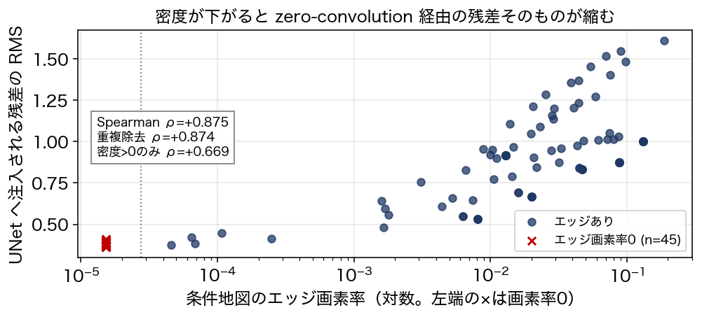

# ControlNet の制御が効かなくなる条件と、その機構

映像メディア学 レポート課題

新井 滉明（Komei Arai）／学籍番号 48266454
東京大学大学院 情報理工学系研究科 電子情報学専攻 修士1年／伊庭研究室
研究テーマ：進化計算・学習における資源の会計（計算量・データ量・モデルの複雑さといった資源を増やすほど成績が上がるとは限らず、その価値がタスクの構造との整合で決まることを扱っている）

ソースコード：https://github.com/komeiall14/controlnet-failure-analysis

---

## 1. 対象論文

Lvmin Zhang, Anyi Rao, Maneesh Agrawala.
"Adding Conditional Control to Text-to-Image Diffusion Models."
*Proceedings of the IEEE/CVF International Conference on Computer Vision (ICCV)*, 2023, pp. 3813–3824. DOI: 10.1109/ICCV51070.2023.00355

採録は Crossref・DBLP・Semantic Scholar の3つで独立に確認した。DBLP 上では arXiv 版（CoRR abs/2302.05543）と会議録版が別項目として登録されており、本会議の full paper である。

この論文が扱っているのは、テキストだけでは指定できない条件を、学習済みの巨大な拡散モデルに後付けする問題である。「猫の絵」はプロンプトで頼めるが、「この輪郭に沿った猫」は言葉にならない。輪郭・深度・人物の姿勢のような空間的な指定を渡したい。素朴には条件つきで再学習すればよいが、Stable Diffusion のような規模のモデルを条件ごとに学習し直す計算資源は個人にはなく、少量のデータで微調整すれば元の生成能力が壊れる。

ControlNet の答えは、元のモデルには一切手を触れないというものである。重みを凍結したまま、そのエンコーダ部分の複製を作って条件を受け取らせ、複製の出力を zero convolution という 0 で初期化した層を通して元のモデルへ残差として加える。0 で初期化されているので学習開始時点では複製の寄与が完全に 0 であり、元のモデルの出力と一字一句一致する。そこから徐々に条件の効き方を学ばせる。凍結された本体が壊れないことが構造で保証されている点が要点である。

同じ枠組みで条件の種類を差し替えられるのも特徴で、輪郭・深度・姿勢・領域分割などがそれぞれ別の分岐として公開されている。学習は単一の民生向け GPU でも成立し、条件の学習は徐々にではなく 1 万ステップ足らずで急に成功するという観察も報告されている。

本レポートは、この手法が期待どおりに働かなくなる条件を実験的に切り出し、その理由を内部の測定から説明することを目的とする。扱うのは輪郭（Canny エッジ）による条件づけである。

## 2. 手法理解

ControlNet は学習済み拡散モデルの重みを凍結したまま、そのエンコーダ部分の複製（trainable copy）を作り、両者を zero convolution で接続する。論文が与える式は

    y_c = F(x; Θ) + Z( F( x + Z(c; Θ_z1) ; Θ_c) ; Θ_z2)

である。ここで F は凍結された元のブロック、c が条件（本レポートでは Canny エッジ地図）、Z が zero convolution である。Z は重みとバイアスを 0 に初期化した 1×1 畳み込みなので、学習開始時点では両方の Z が 0 を返し、y_c = y すなわち元のモデルの出力と完全に一致する。論文がこの設計を採った理由として述べているのは、有害な雑音が微調整に影響しないようにパラメータを 0 から徐々に育てるためである。

残差の重み付けについては、適用条件を正確に押さえておく必要がある。論文が解像度に応じた重み `w_i = 64/h_i`（深いブロックほど強い）を導入しているのは推論の節のうち classifier-free guidance に関する箇所で、条件画像を条件側の予測だけに加える場合の手当てとして述べられている。常にすべての接続へ掛けるとは書かれていない。diffusers 0.31.0 の実装もこれに対応しており、`guess_mode` を有効にしたときだけ `torch.logspace(-1, 0, ...)` という対数平滑版の重みを掛け、既定では全ブロックに `controlnet_conditioning_scale` を一様に掛ける（`diffusers/models/controlnet.py` L844-851）。深いブロックほど強いという向きと約8倍という幅は論文の値と一致しており、移植の欠落ではない。

本レポートの実験はすべて既定設定で行っているので、残差には全ブロックに一様な係数が掛かっている。第5節で段ごとの残差を比較するときに重みの補正を入れていないのはこのためである。推論時に露出しているつまみは `controlnet_conditioning_scale`（既定 1.0）で、上式の第2項に掛かる係数にあたる。

学習の設定で本レポートに直接関わるのは、**プロンプトの 50% を空文字に置き換えて学習している**点である。論文はその狙いを「条件画像の意味を直接認識する能力を高めるため」と述べている。つまりこのモデルは、テキストが無いときには条件地図そのものから意味を読み取るよう仕向けられている。

ここで注意したいのは、両方の Z が 0 を返すのは論文が述べているとおり**学習開始の時点だけ**だという点である。学習後の zero convolution は 0 で初期化された重みが育っているので、条件が空でも 0 を返すとは限らない。実際、学習済みの重みに全画素 0 の地図を入れると条件エンコーダの出力は RMS 0.2554 を持つ（ただしチャネル平均マップの空間標準偏差は 0.0012 で、空間構造をほとんど持たない一様な場である）。加えて第2項は Z(F(x + Z(c;Θ_z1); Θ_c); Θ_z2) であり、条件が消えても潜在変数 x が trainable copy を通る成分は残る。

したがって条件が情報を失ったときに起きるのは、第2項が 0 になることではない。**入力に依存する成分が失われ、空間的な指定を持たない一様な項に退化する**のである。学習が「条件地図から意味を読む」方向に偏っている以上、失われるのは輪郭の指定だけでなく、モデルが読み取るはずだった意味も含む。第5節ではこの退化を残差の大きさとして測る。

論文自身のアブレーションもこの見方を支持する。zero convolution を通常の畳み込みに置き換えると性能が軽量版と同程度まで落ち、その理由を論文は trainable copy の事前学習済みバックボーンが壊れるためだと説明している。制御の強さは追加ネットワークの表現力ではなく、凍結された本体へどう残差を渡すかで決まっている。

なお論文には Limitations に相当する節が置かれていない（arXiv 版本文で確認）。本レポートの第7節で述べる限界は、すべて本実験から見出したものである。

## 3. 実行環境

| | |
|---|---|
| 計算機 | Apple M1（8コアGPU）／RAM 16GB／macOS 14.4.1（23E224） |
| バックエンド | PyTorch 2.2.2 の MPS（CUDA なし） |
| ライブラリ | diffusers 0.31.0／transformers 4.44.2／OpenCV 4.11.0 |
| モデル | Stable Diffusion v1.5 ＋ sd-controlnet-canny。重みは計 1.43×10⁹ パラメータで fp16 なら約 2.7GiB（配布されている fp32 の実体はディスク上 5.3GiB） |
| サンプラ | DPMSolver++ 2M（Karras）20ステップ、512×512 |
| 生成速度 | 20ステップ・512×512 で 1枚あたり 101〜184秒（n=129、中央値 106.8秒、平均 112.9秒）。第4.1節の切り分けだけは DDIM 4ステップなので別条件である |

サンプラの選択には制約があった。当初は公式のサンプルコードに合わせて UniPC を使ったが、この実装は補正段で `torch.linalg.solve` を呼び、この演算が MPS では未実装のため例外で止まる。閉形式の更新だけで済む DPMSolver++ 2M に替えて回避した。CUDA を前提に書かれたコードをそのまま動かせない例である。

## 4. Failure Case Analysis

<!-- 最重要項目。3本立て。 -->

### 4.1 推奨されている省メモリ設定が、沈黙したまま出力を壊す

最初の生成が一枚も成立しなかった。返ってきた画像は 512×512 のすべての画素が値 0、すなわち完全な黒であった（平均 0.0、標準偏差 0.0）。例外も警告も出ず、処理は正常終了する。構造整合の指標だけを見ていれば edge F1 = 0.000 という数字が並ぶだけで、原因は分からない。

切り分けのために、VAE で復号する前の潜在変数を取り出したところ、その段階ですでに NaN が入っていた。復号を fp32 の VAE でやり直しても NaN は消えない。つまり fp16 の VAE が飽和したという既知の話ではなく、UNet の順伝播そのものが壊れている。

原因は `enable_attention_slicing()` だった。発生条件を絞るため、精度 2 通り × slicing の設定 5 通りで潜在変数の NaN を直接調べた（DDIM 4 ステップ、同一シード）。

| | slicing なし | auto | max | 1 | 4 |
|---|---|---|---|---|---|
| **fp16** | 正常（3.38） | **NaN** | **NaN** | **NaN** | **NaN** |
| **fp32** | 正常（4.46） | 正常（4.46） | 正常（4.46） | 正常（4.46） | 正常（4.46） |

括弧内は潜在変数の絶対値の最大である。読み取れることが二つある。第一に、**fp16 と slicing の組み合わせでのみ発生する**。fp32 では slicing を有効にしても値は完全に一致し（いずれも 4.46）、計算そのものは正しい。第二に、**分割の粒度に依存しない**。`auto`・`max`・1・4 のどれでも同じく NaN になる。分割数を減らせば回避できる、という類の問題ではない。

したがって壊れているのは slicing の機構そのものではなく、fp16 の精度で attention を分割して計算する経路である。分割すると中間結果の累積の仕方が変わるため、fp16 の表現範囲では途中で値が溢れると考えられる（この解釈は溢れの箇所を特定したものではなく、上の結果と整合する説明にとどまる）。所要時間は fp16 で 20〜24 秒、fp32 で 88 秒だった。fp32 に切り替えれば回避できるが 4 倍以上遅くなる。本レポートは fp16 のまま slicing を無効にする側を選んだ。

問題は、この設定が推奨されているものだという点にある。diffusers の MPS 最適化に関する公式文書は、RAM が 64GB 未満の環境では `enable_attention_slicing()` を有効にするよう案内している。本レポートの環境は 16GB なのでその条件に当てはまり、案内どおりに従うと生成が全滅する。しかも失敗の仕方が静かなので、指示に従ったユーザーは自分の設定ミスを疑わない。

以降の実験はすべて slicing を無効にして行った。同時に、生成した直後に NaN と単色を検出して例外を投げる検査を組み込んだ。静かに壊れる失敗は、下流のすべての指標を無意味にするからである。

### 4.2 条件地図の密度が下がると制御が消える

Canny の閾値は公式実装の既定値 (100, 200) に固定したまま、入力のコントラストだけを係数 α で落とした系列を作った。構図と内容は変えていないので、変化するのは条件地図の密度だけである。実画像 10 点（skimage.data 同梱）と、円と矩形の反復数だけを変えた合成画像 5 点に対し、α ∈ {0.15, 0.3, 0.5, 1.0} を掛けた 60 条件を生成した。

構造整合は、生成画像から条件と同じ設定で Canny を再抽出し、入力の条件地図との F1 を取って測る（2 画素の許容を入れた膨張マッチング。拡散生成では輪郭が数画素揺れるため、許容なしでは構造が保たれていても F1 がほぼ 0 になる）。

エッジ画素率と構造整合の間には強い順位相関があった（Spearman ρ = +0.819、n = 60）。ただしこの値はそのまま受け取れない。理由は後述するが、条件地図が空の 15 条件では F1 が定義上 0 に固定されるので、それらを除いた 45 条件で取り直すと ρ = +0.577（p = 3.4×10⁻⁵）になる。前者は定義上の 0 に押し上げられた値である。

| 条件地図のエッジ画素率 | n | edge F1 平均 | 中央値 | 標準偏差 |
|---|---|---|---|---|
| 0（完全に消滅） | 15 | — | — | — |
| 〜0.005 | 6 | 0.109 | 0.012 | 0.229 |
| 〜0.02 | 11 | 0.668 | 0.611 | 0.288 |
| 〜0.05 | 14 | 0.721 | 0.748 | 0.145 |
| 0.05〜 | 14 | 0.841 | 0.859 | 0.088 |

密度 0 の行を「—」としたのは、この指標が使えないからである。条件地図が空だと適合率は空虚に 0、再現率は 0/0 になり、生成画像が何であっても F1 が 0 を返す。同じ理由で Chamfer 距離も定義できない。**したがって「密度 0 で F1 が 0」は破綻の測定ではなく、指標の定義から自動的に出る値である。** ここを破綻の証拠として提示することはできない。

代わりに 3 点を述べる。

第一に、60 条件のうち 15 条件でエッジ画素率がちょうど 0 になった。既定の閾値が入力のコントラストに対して高すぎるため、条件地図が真っ黒になる。これは Canny の閾値処理だけで決まるので、同じ入力と同じ閾値なら常に同じ空の地図が出る。シードには依存しない。ただし 15 行のうち生成画像が異なるのは 8 枚で、残りは同一入力に対する重複である（md5 が一致）。独立な観測は 8 件と数えるべきである。

第二に、条件が効いていないことを示すには別の測り方が必要である。密度 0 の生成画像を、**本来指定したかった輪郭**（同じ画像のコントラストを落とさない条件地図）と照合すると F1 は平均 0.2391（n = 15、中央値 0.2198、標準偏差 0.1850）だった。正しく条件づけた生成を同じ指標で測ると 0.7329 である。さらに、無関係な画像どうしを組み合わせたときの偶然一致の水準は 0.2461（n = 210）で、**密度 0 の 0.2391 はこの偶然の水準と統計的に区別できない**（Mann–Whitney U 検定、p = 0.807）。指定した輪郭との一致は偶然の域まで落ちている。

ここで強調しておきたいのは、壊れているのが制御であって生成ではないという点である。密度 0 の生成画像はエッジ画素率 0.0074〜0.2539 を持つ普通の画像で、真っ黒でも崩れてもいない。プロンプトに沿った絵が出てくる。失われているのは輪郭の指定だけである。

第三に、低密度域は成績が悪いだけでなく**ばらつきが大きい**。標準偏差は 0.229 → 0.288 → 0.145 → 0.088 と推移しており、単調ではなく 0.005〜0.02 の帯、つまり崩壊の境目に山がある。ただし帯ごとの標準偏差は主に入力画像の違いを反映しているので、これだけでは生成の不安定さを示せない。そこで密度帯を代表する 5 条件を四分位で選び、シードだけを変えて 5 回ずつ生成した。条件内の標準偏差は平均 0.0644 で、同じ 5 条件の条件平均の標準偏差 0.3543 の約 5 分の 1 にとどまる。密度の効果はシードの揺らぎでは説明できない。

その条件内の標準偏差自体も密度に依存していた（密度 0.0201 で 0.1433、0.1884 で 0.0213）。密度 0.0201 では、同じ入力・同じ設定でシードを変えるだけで edge F1 が 0.4965 から 0.8589 まで動く。壊れかけの領域では制御が効くかどうかが賭けになる。なお最も密度の低い条件（0.0016）の標準偏差が 0.0517 と小さいのは安定しているからではなく、F1 がほぼ 0 に張り付いて動く余地がないためである。

### 4.3 推論時の既定値は構造整合に対して弱すぎる

当初は「最適な `controlnet_conditioning_scale` は入力の密度によって動く」という予想を立て、7 つの入力に対し scale ∈ {0.2, 0.4, 0.6, 0.8, 1.0, 1.3} を振った。**この予想は外れた。** 7 入力すべてで掃引範囲の上限である 1.3 が最良となり、密度との関係は現れなかった（最適値が全件同一のため順位相関は定義できない）。

外れ方から分かったこともある。**既定値 1.0 が最適だった入力は 7 件中 0 件**で、どの入力でも 1.0 から 1.3 へ上げると構造整合が改善した。改善幅は入力によって大きく異なり、密度の低い synth_sparse では 0.333 から 0.877 へ跳ねる一方、密度の高い synth_veryd では 0.957 から 0.978 にとどまる。

ここで注意が必要なのは、この結論が構造整合という一つの指標だけを見た結果だという点である。edge F1 は入力の輪郭をどれだけ再現したかを測るので、条件を強くすれば単調に上がるのが当然である。掃引範囲を狭く取ったために単調増加しか観測できず、代償が見えていない。第 6 節では範囲を 3.0 まで延ばし、プロンプト追従（CLIP 類似度）と併せて評価する。

## 5. 機構の直接証拠：注入される残差そのものを測る

第 4.2 節で示したのは入力と出力の対応にすぎない。密度が下がると成績が落ちるという相関は、条件が効かなくなったからだとも、生成そのものが難しくなったからだとも読める。第 2 節で立てた予測は前者、すなわち zero convolution を通って UNet に加わる残差が縮むというものだった。これは測れる。

ControlNet の順伝播を 1 回だけ実行し、UNet の各段へ渡される残差を取り出して二乗平均平方根を求めた。測定条件は timestep を 500 に固定し、潜在変数もシード 0 で固定した共通のものを使い、条件側の枝だけを見ている（classifier-free guidance の無条件側は測っていない）。全条件で timestep と潜在変数を共有しているので、条件地図の違いだけを取り出した対応のある比較になる。拡散の全過程を回さないので 1 条件あたり 1 秒未満で済み、コントラスト係数を 9 段階に振って掃引できた。

密度と残差の間には強い順位相関があった（Spearman ρ = +0.874、重複を除いた異なる条件地図 83 件）。

| 条件地図のエッジ画素率 | 順伝播の回数 | 総残差 RMS | mid ブロックの RMS |
|---|---|---|---|
| 0（完全に消滅） | 45（異なる地図は 11） | 0.3846 | 0.9333 |
| 〜0.005 | 11 | 0.5161 | 1.2990 |
| 〜0.02 | 28 | 0.8027 | 1.8046 |
| 〜0.05 | 27 | 0.9785 | 2.0590 |
| 0.05〜 | 24 | 1.1114 | 2.0724 |

n 列は独立な観測数ではなく順伝播の回数である。ControlNet の順伝播は決定論的なので、同一の条件地図を与えた行は数値までビット単位で一致する。密度 0 の 45 行が取る値は実際には 11 通りしかなく、それはプロンプトの種類と一対一に対応している（0.3608〜0.4090、標準偏差 0.0150）。

ここで一つ、当初は発見として書きかけて撤回した点を明示しておきたい。密度 0 とは Canny の出力に 1 画素もエッジが立たなかったことなので、その条件地図は全画素 0 の配列であり、参照として用意した空白の地図と**ビット単位で同一の入力**である。timestep と潜在変数も固定しているので、両者の残差が一致するのは測定する前から確定している。恒等式を経験的な一致として提示するのは誤りなので、この比較は主張から外した。

機構として意味を持つのは、密度が正の領域での減衰である。総残差は 1.1114 から 0.3846 へ単調に下がる。個々の画像内でも同じ傾向が出ており、実画像 10 点のうち 9 点でコントラストを落としたときの密度と残差の順位相関が +0.98 以上だった。画像の内容を固定して密度だけを動かしても残差が縮むので、画像間の差では説明できない。

第 2 節で述べたように、条件が失われても第 2 項は 0 にはならない。実際、空白の地図でも総残差 0.3846〜0.4090、mid ブロックで 0.9333 が残る。残っているのは条件の内容に依存しない一様な成分であり、空間的な指定を持たない。**制御が消えるのは残差が消えるからではなく、残差から入力依存の構造が抜け落ちるからである。**

残差は高密度側で飽和もしている。0.05 を超えると総残差の増加が緩み（0.9785 → 1.1114）、mid ブロックではほぼ横ばいになる（2.0590 → 2.0724）。出力側の edge F1 は同じ帯でまだ上がり続けている（0.721 → 0.841）ので、**内部で先に飽和が起きているのに出力にはまだ余地がある**という非対称がある。内部の飽和がそのまま出力の飽和になるわけではない。

## 6. 改善と、その前後比較

第 4.2 節と第 5 節から、条件が効かなくなる原因は閾値が固定されていることに帰着する。入力のコントラストが変われば同じ閾値でもエッジ画素率が桁で動き、極端な場合は 0 になる。ならば閾値ではなく**密度を揃えればよい**。

実装は二つの部品からなる。一つは目標エッジ画素率（0.045 に設定した）に当たるまで Canny の高閾値を二分探索する前処理で、探索の前に CLAHE で局所コントラストを補正する。もう一つは、得られた密度に応じて `controlnet_conditioning_scale` を線形に調整する規則である。どちらも拡散を回す前の処理なので、**生成 1 枚あたりの計算コストは増えない**。

評価は同一の画像・同一のプロンプト・同一のシードで改善前と改善後を対にして行った。15 画像 × コントラスト 2 水準 × シード 3 個で 90 対である。ここで検定の単位に注意が必要になる。1 枚の画像から 6 行が出るので、90 行をそのまま対応のある検定にかけると独立性が崩れて標本数が水増しされる。シードは画像内で平均し、画像を単位とした。さらに**コントラストの水準を混ぜてはいけない**。混ぜると次に示すように符号が打ち消し合う。

| コントラスト | n（画像） | 改善した画像 | Δ 中央値 | Wilcoxon p |
|---|---|---|---|---|
| α = 0.3（低コントラスト） | 15 | 12 / 15 | **+0.1194** | 0.041 |
| α = 1.0（原画像） | 15 | 5 / 15 | **−0.0784** | 0.188 |

**低コントラスト側では改善し、原画像側では悪化している。** この二層を平均すると相殺されて「差がない」という結論になるが、それは実態を隠す。

低コントラスト側で効いているのは筋が通っている。改善前の平均密度 0.0270 が 0.0354 へ上がり、目標に近づいている。実際に条件地図が空になっていた 2 画像では Δ 中央値が +0.6974 で、密度が 0 から平均 0.0346 へ回復した。ただしこの 2 画像については改善前の F1 が定義上 0 なので、数値は「指標が使える状態に戻せたか」を示すものであり、改善幅としては読めない。

原画像側で悪化する理由も説明できる。もともと密度が 0.0647 で目標 0.045 を上回っているため、密度連動の規則が scale を平均 0.854 まで下げてしまう。第 4.3 節で見たとおり構造整合は scale を上げるほど改善するので、下げれば悪化する。**改善は密度を目標へ寄せる方向にのみ働き、既に十分な入力に対しては条件を弱める副作用を持つ。**

正直に言えば、この改善は条件つきでしか有効でない。標本数も片側 15 画像で検出力は低く、有意水準を辛うじて下回った α = 0.3 の結果も強い証拠とは言えない。**密度が目標を下回るときにだけ適用する**という条件を付けるのが妥当で、それは実装としては一行の判定で済む。

## 7. Limitations

本レポートの結論には以下の制約がある。書ける範囲を広げるより、どこまでしか言えないかを明示することを優先した。

**指標の設計に依存している。** 構造整合は生成画像から再抽出した Canny との F1 で測っているが、この量は 2 画素の許容幅、再抽出時の閾値、膨張マッチングという設計判断に依存する。許容幅を変えれば数値は動く。さらに第 4.2 節で述べたように、条件地図が空のときこの指標は定義から 0 を返すので使えない。指標が壊れる領域を指標で測ろうとしたのが当初の誤りだった。代替として偶然一致の水準との比較を導入したが、これも「本来指定したかった輪郭」を人為的に選んでいる。

**標本数が小さい。** 第 6 節の改善前後比較は片側 15 画像、シードは 3 個である。α = 0.3 での有意性（p = 0.041）は有意水準を辛うじて下回った程度で、強い証拠ではない。第 4.2 節のシード分散も 5 条件 × 5 シードにとどまる。

**条件の種類が輪郭のみである。** 深度・姿勢・領域分割による条件づけでは、条件地図の情報量の定義が変わるので、同じ議論がそのまま通るとは限らない。密度という一次元の量で情報量を代表させたことも、輪郭に特有の単純化である。

**環境に固有の可能性がある。** 第 4.1 節の NaN は M1 / PyTorch 2.2.2 / MPS / fp16 という組み合わせで観測したものである。精度と分割の粒度については条件を絞れたが、他の PyTorch 版や他のハードウェアで再現するかは確認していない。溢れが生じている箇所を計算グラフの中で特定したわけでもなく、fp16 で分割経路を通ると壊れるという入出力レベルの事実にとどまる。ただし推奨設定に従うと例外を出さずに壊れるという構図自体は、環境が違っても起こりうる形をしている。

**Stable Diffusion v1.5 系に限られる。** SDXL や後続のモデルで同じ挙動になるかは検証していない。

**論文自身の主張を検証したものではない。** 本レポートが扱ったのは推論時の使い方であり、論文が報告している学習の性質や他手法との比較を追試したわけではない。論文に Limitations の節が置かれていないため、ここで挙げた限界はすべて本実験から見出したものである。

## 8. 考察

第 4.3 節では scale を 1.3 まで振って、上げるほど構造整合が良くなるという結果を得た。そこで掃引を 3.0 まで延ばし、同時に CLIP 類似度でプロンプト追従を測った。

| scale | 0.2 | 0.6 | 1.0 | 1.6 | 2.0 | 2.5 | 3.0 |
|---|---|---|---|---|---|---|---|
| edge F1 | 0.251 | 0.589 | 0.717 | 0.909 | **0.925** | 0.920 | 0.919 |
| CLIP 類似度 | **0.304** | 0.302 | 0.291 | 0.273 | 0.271 | 0.262 | 0.258 |

構造整合は 2.0 で頭打ちになるが、プロンプト追従はそこを越えても下がり続ける。scale と両者の順位相関は逆向きで（構造整合 ρ = +0.788、プロンプト追従 ρ = −0.547、n = 70）、二つの指標そのものが負の相関を持つ（ρ = −0.521、p = 3.8×10⁻⁶）。**第 4.3 節で得た「上げるほど良い」は、片方の指標だけを見ていたために生じた見え方だった。**

両方を正規化して和を最大化する scale を入力ごとに求めると、0.6 から 3.0 まで散る。構造整合だけで選ぶと全入力が 1.6〜3.0 の狭い範囲に集まるのに、両立を求めると入力ごとに異なる。当初の予想は「最適な scale は入力によって動く」だったが、これは片方の指標では否定され、両方を見たときに成立した。予想の当たり外れが**何を測るかで反転した**ことになる。

ここに本レポートを通じた見方が現れている。条件の強さは、増やすほど良い資源ではない。第 4.2 節と第 5 節で見たのは資源が足りない側の破綻で、条件地図の密度が下がると注入される残差から入力依存の構造が抜け落ちる。第 8 節で見たのは資源が過剰な側の代償で、輪郭に従わせるほどプロンプトから離れる。そして密度と scale は、どちらも同じものを動かしている。密度が高い入力に高い scale を掛ければ条件は過剰に効き、密度が低い入力では scale を上げても効かせる中身がない。**この二つは、条件の実効的な強さという一つの量に対する別々の支払い方である。**

だから最適値は入力の中にあるのではなく、入力の構造と、何を達成したいかの組み合わせの中にある。同じ scale = 2.0 が、輪郭の再現を目的とするなら最良で、プロンプトへの忠実さを目的とするなら過剰になる。第 6 節の改善が低コントラストでは効いて原画像では悪化したのも同じ構図で、密度を目標へ寄せる操作は、目標を下回る入力にだけ意味を持つ。

筆者は大学院で、計算量やデータ量といった資源を増やすほど成績が上がるとは限らず、その価値がタスクの構造との整合で決まることを扱っている。本レポートで扱った条件の強さは、その意味での資源の一例として読める。ただし対応を強調しすぎないよう注意したい。ここで示せたのは単一の手法・単一の条件タイプにおける一例であり、資源一般について何かを言えたわけではない。むしろ有用なのは逆向きの示唆で、**手法の既定値は目的が一つに定まっているときの値であり、測る指標を変えれば既定値の妥当性も変わる**という点である。ControlNet の `controlnet_conditioning_scale = 1.0` は構造整合の観点では明らかに弱いが、プロンプト追従を含めれば妥当な妥協点になっている。既定値が「弱すぎる」と読めたのは、こちらが片方しか測っていなかったからである。

## 9. 生成AI利用

**使用したもの**: Claude（Anthropic）。対話および自律実行の両方の形で用いた。

**用途**: 実験コードの作成（条件地図の生成、指標の実装、掃引の自動化）、実験結果の統計処理と作図、本レポートの文章作成、および完成前の批判的レビュー。

**自分で判断・修正した箇所**は以下である。

会議名について、生成AI が Web 検索の要約から「CVPR 2023」と提示した。Crossref で DOI を直接照合し、DBLP と Semantic Scholar でも確認して ICCV 2023 と訂正した。DBLP 上で arXiv 版と会議録版が別項目であることも自分で確かめている。

論文の記述の扱いでも訂正が必要になった。当初は「論文が定める解像度依存の重みが diffusers の既定では効いていない」という食い違いを指摘する形で書いていたが、論文の該当箇所を読み直すと、その重みは classifier-free guidance に関する特定の場合の手当てとして述べられており、実装の `guess_mode` がそれに正しく対応していた。実装の不備ではなかったので撤回した。

最も重い訂正は、主張の根拠そのものに関わるものだった。「条件地図が空のとき edge F1 が例外なく 0 になる」ことを決定的な破綻の証拠として書いていたが、指標の実装を読み直すと、条件が空の場合は生成画像が何であっても 0 を返す。測定ではなく定義から出る値だった。同様に「空の条件地図の残差が参照値とほぼ一致する」という比較も、両者がビット単位で同一の入力であるため恒等式にすぎなかった。どちらも撤回し、偶然一致の水準との比較（Mann–Whitney U 検定）と、密度が正の領域での減衰に置き換えた。

改善前後の比較では、検定の単位を自分で修正した。1 枚の画像から 6 行が出るデータをそのまま対応のある検定にかけると標本数が水増しされる。またコントラストの水準を混ぜると符号が打ち消し合うため、層別が必要だった。

数値はすべて自分の手元の実測データから再計算して確認している。生成AI が提示した数値をそのまま本文に載せた箇所はない。

## 参考文献

[1] Lvmin Zhang, Anyi Rao, Maneesh Agrawala. "Adding Conditional Control to Text-to-Image Diffusion Models." *Proceedings of the IEEE/CVF International Conference on Computer Vision (ICCV)*, 2023, pp. 3813–3824. DOI: 10.1109/ICCV51070.2023.00355

[2] Robin Rombach, Andreas Blattmann, Dominik Lorenz, Patrick Esser, Björn Ommer. "High-Resolution Image Synthesis with Latent Diffusion Models." *Proceedings of the IEEE/CVF Conference on Computer Vision and Pattern Recognition (CVPR)*, 2022, pp. 10674–10685. DOI: 10.1109/CVPR52688.2022.01042

[3] Hugging Face. "Metal Performance Shaders (MPS)." diffusers documentation. https://huggingface.co/docs/diffusers/en/optimization/mps （本レポートで問題にした `enable_attention_slicing()` の推奨が記載されている箇所）

[4] diffusers v0.31.0 実装（`src/diffusers/models/controlnet.py`）。解像度依存の重み付けが `guess_mode` 有効時のみ適用されることの確認に使用した。

[5] Stéfan van der Walt, Johannes L. Schönberger, Juan Nunez-Iglesias, François Boulogne, Joshua D. Warner, Neil Yager, Emmanuelle Gouillart, Tony Yu, and the scikit-image contributors. "scikit-image: image processing in Python." *PeerJ* 2:e453, 2014. DOI: 10.7717/peerj.453 （入力画像として同梱データを使用。各画像の帰属は LICENSE_DATA.md に記載）

書誌情報は [1] [2] [5] について Crossref で DOI を直接照合し、[1] はさらに DBLP と Semantic Scholar で独立に確認した（DBLP 上では arXiv 版 CoRR abs/2302.05543 と会議録版が別項目として登録されており、本会議採録である）。
